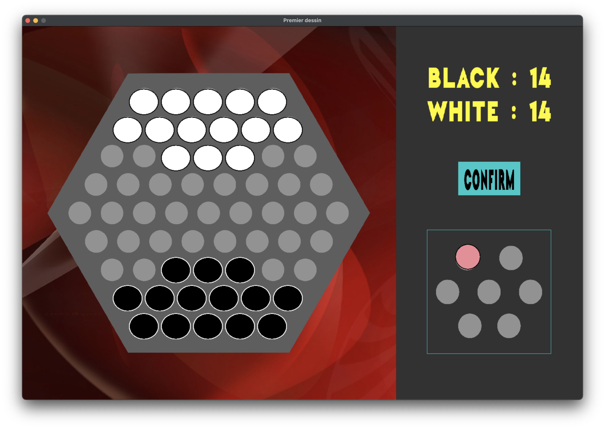
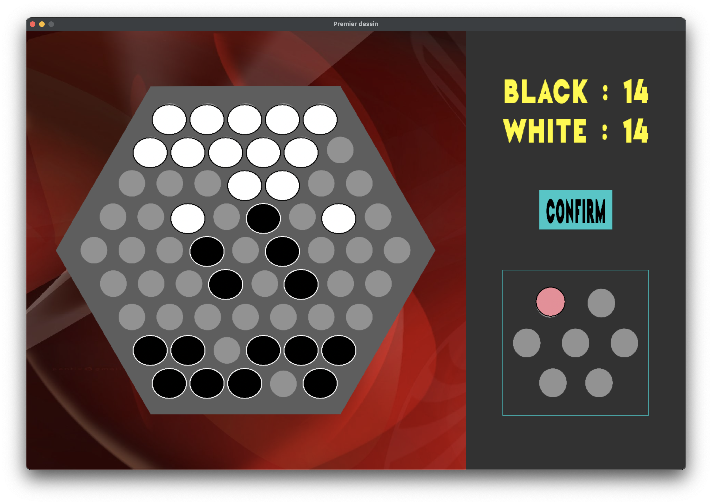

# abalone

This first project uses the game **Abalone** to implement the **min-max** algorithm with the **alpha-beta** pruning.

## Roadmap
- [x] Create the structure of the game.
- [x] Create a graphical interface in SDL2.
- [x] Implement the min-max algorithm.
- [x] Implement the alpha-beta pruning.
- [x] Improve our heuristics.

## Principle
It is a 1v1 game, you play against our algorithm.
Each player has 14 balls, one wins if it pushes over every opponent ball.

<!-- ### Rules -->


<!-- ### Goal -->
<!-- The goal is to push every ball of the opponent out of the board. -->

## To launch the game
```bash
make dir
make
./bin/main
```

## Screenshots





