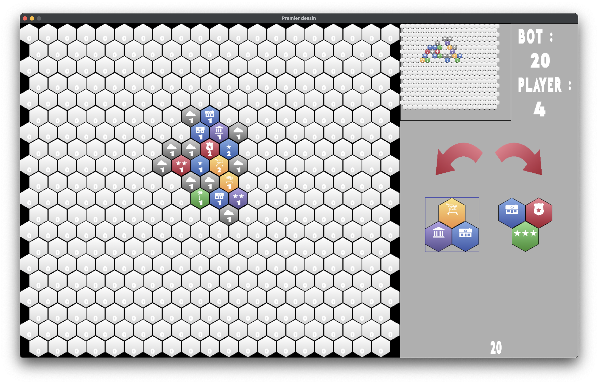

# akropolis

This second project uses the game **Akropolis** to implement **reinforced learning** algorithms such as **MCTS**.

## Roadmap
- [x] Create the structure of the game.
- [x] Create a graphical interface in SDL2.
- [x] Implement the MCTS algorithm.
- [x] Implement board zoom.

## Principle
It is a 1v1 game, you play against our algorithm.
Each player has a hexagonal board in front of him, and a tile deck is shared between them.
At every turn, the player chooses a tile from the deck and places it on its board following the rules.
The winner is the one with the highest score.

<!-- ### Rules -->
<!-- [...] -->

<!-- ### Goal -->

## To launch the game
```bash
make dir
make
./bin/main domitille
```

## Screenshots

